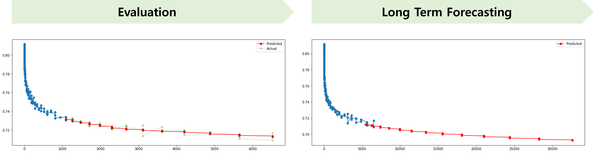

# demagnetization-prediction

## About the Project
영구자석은 모터를 구성하는 핵심 소재 중 하나이며, 특히 전기차 구동모터의 경우 고성능 희토류 영구자석이 주로 사용되고 있다.
비가역 감자는 영구자석의 고장 현상으로 정의할 수 있고, 영구자석의 수명은 감자율이 특정 값에 도달하는 시간으로 정의할 수 있게 된다.
문제는, 영구자석의 신뢰성 수명예측 모델이나 가속수명시험법 등이 알려져 있지 않아 장기내구수명까지 고려한 재질선정이 어렵다.
따라서 본 프로젝트에서 영구자석의 비가역 열감자 현상을 시간의 함수로 예측 가능한 모델을 구현하는 것을 목표로 한다.

## Architecture

### Train Methodology 
데이터셋을 가지고 총 1년간의 감자율을 학습 및 테스트하여 모델을 성능을 확인하는 Evaluation 과정과
Evaluation 기간 이후의 전체  5년간의 장기 예측을 하는 Long Term forecasting 으로 구분하였다

  
<b>Figure 1.</b> Train Methodology.

## Prediction Result example

  
<b>Figure 2.</b> Prediction Result example.

